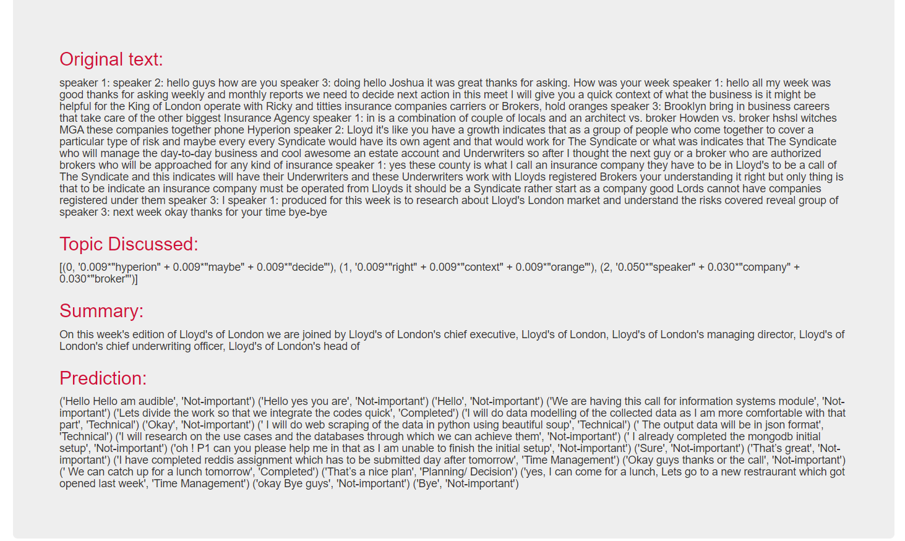

# Case-Study-Automation-MoM
Automation of Minutes of meeting on python. Consists of various epics 1. Speech to text using google cloud platform 2. Topic modelling 3. Text summarisation 4. Text classification 

